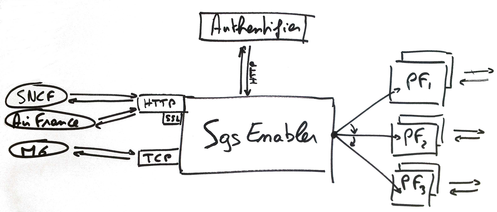

---
# Ready to Go ?
[Retour d'expérience sur un projet en Golang]
\[goo.gl/TpHJLq](http://goo.gl/TpHJLq)
---
# This is where it all began
---
/Qui sommes nous ?/L'équipe (B)

L'équipe des développeurs ayant participé au projet est constituée de :

- ###Michel Casabianca
`michel.casabianca@orange.com`
- ###Benjamin Chenebault
`benjamin.chenebault@orange.com`
- ###Jacques Antoine Massé
`ja.masse@orange.com`

---
/Qui sommes nous ?/La plate-forme XMS (B)

### Plate-forme d'envoi et réception SMS/MMS entre des éditeurs de service et des usagers mobiles


- 30 applis en production
- Langages Java, C & Python
- 6 dev, 3 ops   
- Plusieurs centaines de clients
- 900 millions de sms/an
- 23 millions d'€ de CA

---
/Qui sommes nous ?/Le projet SGS-enabler (B)

### Principal frontal d'accès à la plateforme XMS



- Module d'authentification
- Routeur
- Load balancer
- Serveur TCP & HTTP

---
/Qui sommes nous ?/Soucis de maintenance (B)

### Maintenance très complexe et coûteuse

- Développé par un grand nombre de personnes

- Agrégat de design patterns : Observer, Factory, Object pool, Composite

- Très peu, voire aucune documentation

- Beaucoup de problématiques réseau

- Problématiques d'accès concurrent réglés à coups de ConcurrentHashMap, de ScheduledThreadPoolExecutor noyés dans des blocs synchronisés

- Monitorées à partir beans exposés en JMX

---

/Qui sommes nous ?/Conclusion (B)

### Conclusion

Malgré des mois passés à débugger l'application, elle n'a jamais été suffisament stable pour pouvoir y migrer tous nos clients

**Il a donc été envisagé de réécrire l'application**
---

# Etude technique

---
/Etude technique/Périmètre (M)

### Le périmètre de l'étude technique

- Un seul connecteur (frontal HTTP)

- Fonctionnalités principale
  - Parsing XML
  - Authentification par IP
  - Appel d'un serveur par TCP

---
/Etude technique/Critères de choix (M)

### Critères de choix de la technologie

- Simplicité de développement

- Maintenance facile du code

- Performances au runtime

- Consommation ressources CPU/mémoire

---
/Etude technique/Les alternatives (M)

### Alternatives techniques

L'existant a été développé en Java avec utilisation des NIO non bloquantes. 

Les alternatives envisagées ont été les suivantes :

- Java avec utilisation d'IO synchrones/multithread
- Go avec utilisation des channels et de goroutines

Les deux POCs ont été developpés en parallèle en 10 jours environ

---
/Etude technique/Résultats (M)

### Les résultats des POCS

- Nombre de lignes de code comparable

- Moins complexe en Go

- Tests en charge en faveur de Go (10% environ)

Mesures effectuées :

- Nb de requêtes par seconde

- Temps moyen de traitement d'une requête

---
/Etude technique/Nombre de requêtes par seconde (M)

### Nombre de requêtes par seconde


---
/Etude technique/Temps moyen par requête (M)

### Temps moyen par requête


---
# Le langage Go
---
/Le Go/Présentation Générale (JA)

### Go est un langage :

- Créé par Google en 2007

- Procédural, un peu objet, un peu fonctionnel
 
- Garbage collecté

- Compilé

- Typage fort, statique

- Orienté concurrence

- Open source

---
/Le Go/Channels (JA)

### Les channels

```go
package main

func main() {
	c := make(chan int, 1)
	c <- 42
	val := <-c
	println(val)
}
```

<http://play.golang.org/p/Kq0Ih_NwIH>

- Primitive du langage
- File FIFO
- Très largement utilisée pour gérer la concurrence et les attentes de thread

---

/Le Go/Goroutines (JA)

### Les Goroutines

```go
package main

func producer(c chan string) {
	c <- "hello"
}

func consumer(c chan string) {
	for {
		println(<-c)
	}
}

func main() {
	c := make(chan string)
	go consumer(c)
	producer(c)
}
```

- Primitive du langage
- Très légères (~4ko)
- Task switching peu significatif
- Multiplexé sur un ou plusieurs threads de l'OS

<http://play.golang.org/p/y6W8I8lJYA>

---
/Le Go/Commandes Go (JA)

### Les commandes Go

- go build
	- Compilation

- go run
	- Compilation + exécution

- go test
 
- go dep


[...]
 

---
/Le Go/Exécutables (JA)

### Les exécutables

- Binaire sans dépendance dynamique

- Volumineux 
	- "Hello world" ~ 1 Mo
    - Notre application ~ 9 Mo
	- Embarque toutes les bibliothèques utilisées

- Plate Formes supportées : 
	- FreeBSD et Linux 32/64 sur x86 et ARM, Windows, MacOS,…

---
/Le Go/Environnements (JA)

### L'environnement de développement

- go code

- Existence de modes pour emacs et vi :
	- go-vim
	- go-snippets, autocomplete, flycheck, etc.
	
- Liteide
	- Open Source
	- Ecrit en Go

- Plugins Eclipse, IntelliJ, etc.

---

# Les écueils

---

/Les écueils/Gestion des Erreurs (M)

### La gestion des erreurs est rébarbative

Source Go typique :

```go
f, err := os.Open("filename.ext")
if err != nil {
    log.Fatal(err)
}
```

Cette gestion des erreurs :

- Est répétitive
- On ne peut gérer des erreurs *en bloc*
- On ne peut typer les erreurs

Il est possible de lancer des *paniques* :

- Elles sont propagées
- Peuvent être interceptées
- Ce ne sont cependant pas des exceptions

---
/Les écueils/APIs simplistes (M)

### APIs simplistes

L'API de logs est assez critiquée car elle :

- Ne gère pas des niveaux de logs

- Ne gère pas des fichiers de configuration

- Doit donc être configurée dans le code

L'API de parsing des options en ligne de commande ne respecte par les standards Unix.

---
/Les écueils/Certificats (M)

### Certificats

Nous avons rencontré des difficultés pour la gestion des certificats :

- Des certificats générés sans l'option `ExtendedKeyUsage` (valeur `clientAuth`) ne peuvent servir à authentifier un client

- L'algorithme MD5 n'est pas supporté pour la signature de certificats bien qu'il soit dans la liste des algorithmes supportés par TLS 2.1

Si tous ces choix sont probablement pertinents, ils peuvent poser des problèmes avec l'existant

---
/Les écueils/Gestion des encodages (M)

### Gestion des encodages

Seul l'*UTF-8* et l'*UTF-16* sont supportés.

Nous sommes tous d'accord que ce choix est évident, cependant cela peut rendre difficile la gestion de l'existant.

---
/Les écueils/Vendorisation (B)
###La vendorisation

- Absence volontaire de package manager natif

- go get clone le last commit des repo GitHub, Bitbucket, Google code

- "There is no need for a central archive of every version of every Go library ever released. Dependencies may move or disappear in the world outside your project. Versioning is a source of significant complexity, especially in large code bases" (Golang FAQ)

- Package managers développé par la communauté : gopack, godep, GoManager, dondur, 

```toml
[deps.memcache]
import = "github.com/bradfitz/gomemcache/memcache"
tag = "1.2"

[deps.mux]
import = "github.com/gorilla/mux"
commit = "23d36c08ab90f4957ae8e7d781907c368f5454dd"
...
```

---

#Les Bonnes Surprises

---
/Bonnes surprises/Montée en compétence (JA)

### Montée en compétence rapide

- Courbe d'apprentissage douce

- La syntaxe est simple 
	- "Langage procédural à accolades"
- Outillage efficace

- Goroutine et channels
	- Patterns de concurrence

- Features avancées
	- Composition de structures
	- Programmation "fonctionnelle"
	- Polymorphisme

---

/Bonnes surprises/Qualité des APIs (JA)

### Qualité des API

```go
package main

import (
	"fmt"
	"io/ioutil"
	"log"
	"net/http"
)

func main() {
	res, err := http.Get("http://www.google.com/robots.txt")
	if err != nil {
		log.Fatal(err)
	}
	robots, err := ioutil.ReadAll(res.Body)
	res.Body.Close()
	if err != nil {
		log.Fatal(err)
	}
	fmt.Printf("%s", robots)
}
```

http://play.golang.org/p/VPwJf7DuUo

---
/Bonnes surprises/Monitoring (B)

### Monitoring

- Utilisation du package [pprof](http://golang.org/pkg/net/http/pprof/)

- Aucune instrumentation de code nécessaire

- Génération de heap dump et de cpu profiling

- Le package se bind sur un serveur HTTP

- `go tool pprof`, outil de visualisation des pprofs


---
/Bonnes surprises/API de tests (B)

###  L'API de tests

- Utilisation du package [testing](http://golang.org/pkg/testing/)

- Par convention, les fichiers de tests sont nommés XXX_test.go

- `go test` permet d'exécuter les tests

- Il existe deux types de test :
    - Les tests unitaires : `TestXxx(*testing.T)`
    - Les benchmarks : `BenchmarkXxx(*testing.B)`
    
```go
import "testing"

func TestFunctionTralala(t *testing.T) {
    if "tralala" != "tralala" {
        t.Fail()
    }
}
```

Simplissime mais efficace
---
/Bonnes surprises/Accès concurrents (M)

### Accès concurrents

Il est possible de lancer les tests unitaires avec l'option `-race`. Go est alors capable de détecter les acceès concurrents à la mémoire.

Mais il est aussi possible d'appliquer cette option à la compilation pour détecter les accès concurrents au runtime. Ceci peut être utile si la couverture de test est faible, mais attention aux performances.

---
/Bonnes surprises/Stabilité de l'application (M)

### Stabilité de l'application

Au cours de nos développements et de nos tests de charge, nous n'avons jamais vu planter notre logiciel :

- Pas de SegFault ni de core dump.

- Parceque pas d'arithmétique de pointeurs

---
/Bonnes surprises/Support et communauté (JA)

### Support et communauté

- Bonne documentation des APIs

- Code source disponible 

- Existense de nombreuses lib sur Github

- Nombreux blogs persos et évènements

- Et super mascotte


---
/Bonnes surprises/Open source (JA)

### Open source

Google a joué pleinement le jeu de l'Open Source :

- La licence du logiciel est très ouverte (de type BSD)

- Code source très clair et facilement modifiable

- Développement dynamique


---
# Retour sur les performances et la maintenabilité
---
/Performances/Poste de Développement (M)

### Poste de Développement

- Affranchissement des limitations réseau

- Mocks plus performants qu'implémentations réelles

Les résultats sont les suivants :

- 254 req./s pour la version en GO
- 139 req./s pour la version en Java

---
/Performances/Préproduction (M)

### Préproduction

- Limité par les performances des applications connexes

Les résultats sont les suivants :

- 30 req./s pour la version en GO
- 30 req./s pour la version en Java (avec drop de paquets)

---
/Performances/RAM & CPU (M)

### RAM et CPU

- Environnement de préproduction

- A charge égale

- Java : 94% CPU, 8.5% RAM

- Go :   2% CPU,  1.2% RAM

--- 
/Performances/Maintenabilité (M)

### Maintenabilité

- Syntaxe plus simple

- Apis plus accessibles

- Pas de hiérarchie d'objets

- Pas de patterns
 
---
# Conclusion (B)

Expérience concluante

Projet en préproduction

Un langage syntaxiquement et conceptuellement simple 

Adapté pour des applications pour lesquelles la performance est un enjeu

Outillage très simple à utiliser

Outils de profiling

Un vrai plaisir... ;)

